# Ecommerce React Native

Aplicación móvil de comercio electrónico desarrollada con Expo y React Native. La app abre directamente en la experiencia de tienda, permite navegar categorías y productos, administrar un carrito persistente, crear órdenes en Firebase Realtime Database, editar un perfil local y seleccionar una foto con cámara o galería.

## Funcionalidades

- Catálogo de categorías y productos desde Firebase Realtime Database.
- Consumo remoto con RTK Query y rutas REST de Firebase.
- Respaldo sin conexión con caché local SQLite y datos semilla.
- Carrito global con Redux Toolkit y persistencia SQLite.
- Creación y listado de órdenes usando RTK Query.
- Validación y descuento de stock al confirmar el carrito.
- Perfil local editable guardado con SQLite.
- Foto de perfil con cámara o galería usando `expo-image-picker`.
- Navegación con React Navigation, pestañas y navegadores tipo stack.
- Listas optimizadas con `FlatList`.
- Componentes reutilizables para productos, categorías, carrito, órdenes, botones, carga, error y estados vacíos.

## Tecnologías usadas

- Expo SDK 54.
- React Native.
- React Navigation.
- Redux Toolkit.
- RTK Query.
- Firebase Realtime Database REST API.
- expo-sqlite.
- expo-image-picker.

## Evidencia visual del flujo

Las siguientes capturas corresponden a la APK instalada y ejecutada en un dispositivo Android físico. Muestran el flujo principal de tienda, detalle, carrito, creación de orden, actualización de stock y perfil local.

| Catálogo | Detalle de producto | Producto agregado |
| --- | --- | --- |
| 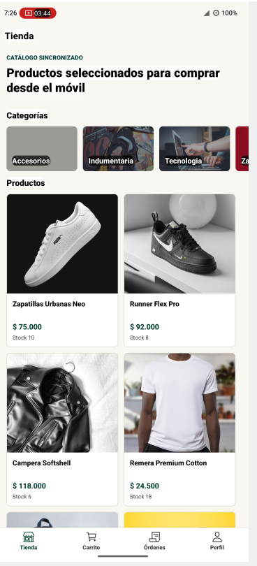 | 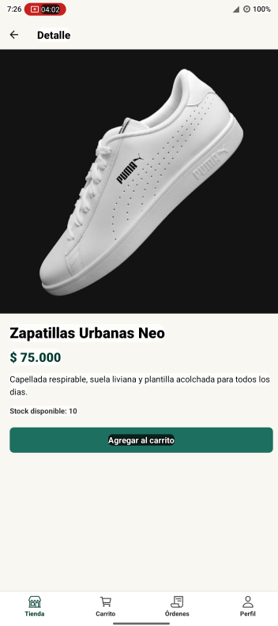 | 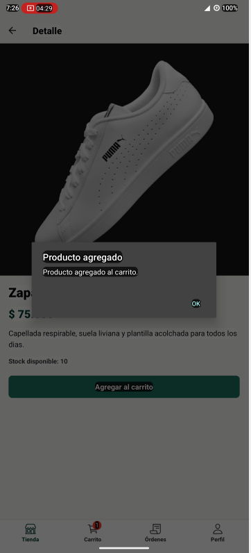 |

| Carrito con stock | Orden creada | Listado de órdenes |
| --- | --- | --- |
| 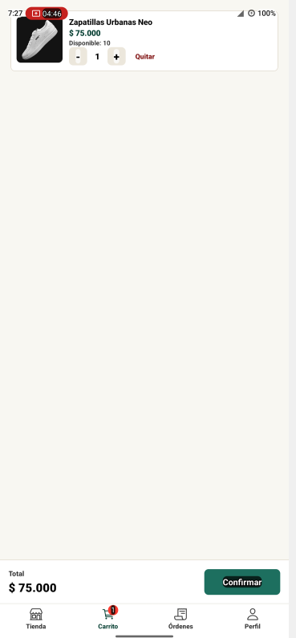 | 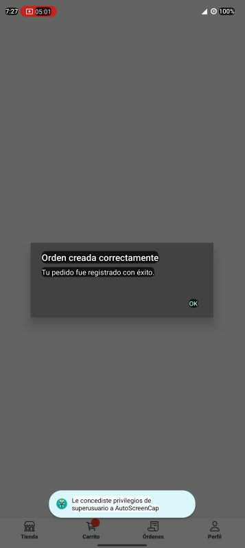 | 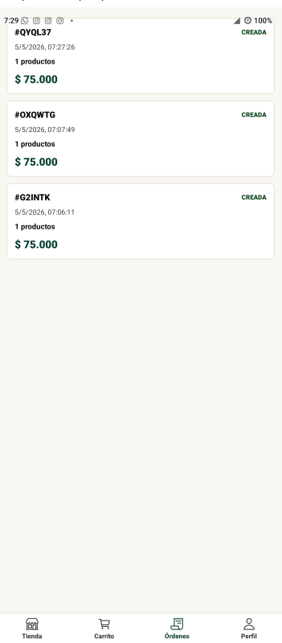 |

| Stock actualizado | Perfil local | Edición de perfil |
| --- | --- | --- |
|  | 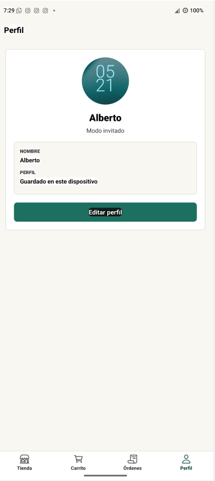 | 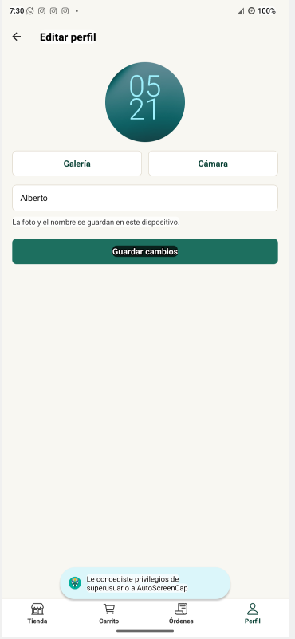 |

| Inicio limpio | Orden posterior | Stock posterior |
| --- | --- | --- |
| 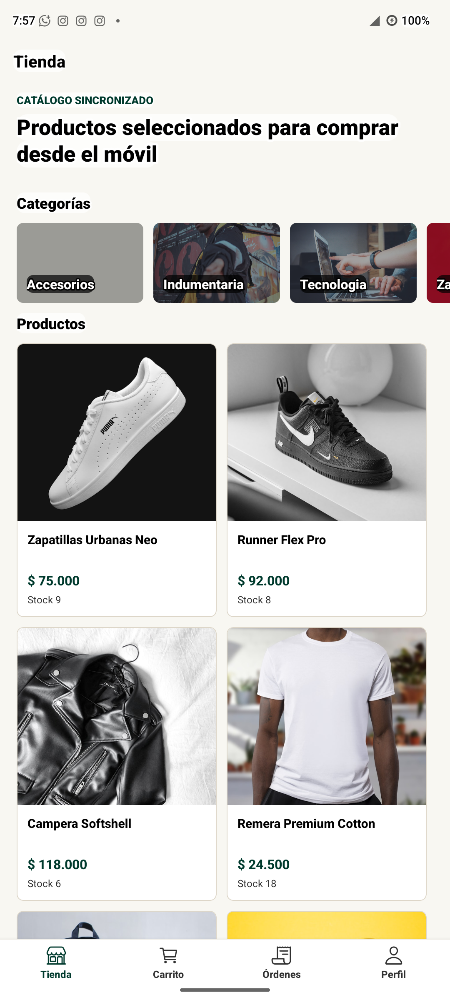 | 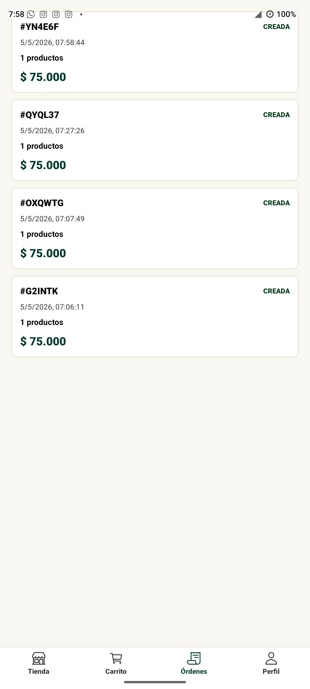 | 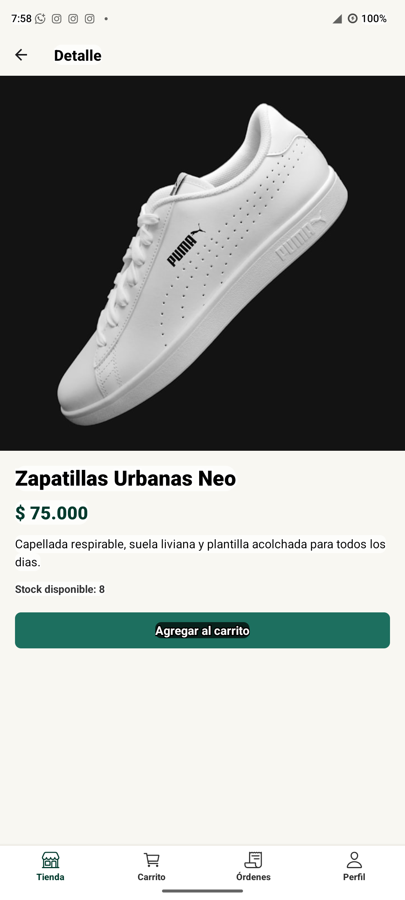 |

## Evidencia técnica de validación

Validación realizada el 5/5/2026 sobre un Motorola Edge 20 pro conectado por ADB.

- `npx expo start -c`: Metro inició correctamente.
- `npx expo export --platform android --output-dir dist`: exportación Android completada, con 966 módulos empaquetados.
- `./android/gradlew.bat -p android assembleRelease -PreactNativeArchitectures=arm64-v8a --no-daemon`: build release completada correctamente.
- `adb install -r builds/ecommerce-rn.apk`: instalación completada con `Success`.
- `adb shell pm list packages com.amalberto.ecommercern`: paquete instalado como `com.amalberto.ecommercern`.
- `adb shell pidof com.amalberto.ecommercern`: aplicación ejecutándose en el dispositivo.
- Prueba limpia posterior: se desinstaló la app, se instaló la APK final, se creó una orden nueva y el stock de `Zapatillas Urbanas Neo` bajó de 9 a 8.
- APK final: disponible como asset en el release [v1.0.0](https://github.com/amalberto/ecommerce-rn/releases/tag/v1.0.0), 29.707.568 bytes.

## Instalación

```bash
npm install
```

## Configuración de entorno

Crear un archivo `.env` en la raíz del proyecto basado en `.env.example`.

```env
EXPO_PUBLIC_FIREBASE_API_KEY=tu_api_key_publica
EXPO_PUBLIC_FIREBASE_AUTH_DOMAIN=tu-proyecto.firebaseapp.com
EXPO_PUBLIC_FIREBASE_DATABASE_URL=https://tu-proyecto-default-rtdb.firebaseio.com
EXPO_PUBLIC_FIREBASE_PROJECT_ID=tu-proyecto
EXPO_PUBLIC_FIREBASE_STORAGE_BUCKET=tu-proyecto.firebasestorage.app
EXPO_PUBLIC_FIREBASE_MESSAGING_SENDER_ID=000000000000
EXPO_PUBLIC_FIREBASE_APP_ID=1:000000000000:web:tu_app_id
```

La app consume Realtime Database mediante `EXPO_PUBLIC_FIREBASE_DATABASE_URL`. Las demás variables públicas se dejan como referencia para completar la configuración del proyecto Firebase, pero esta versión no usa Firebase Authentication ni inicializa el SDK de Firebase.

Si `EXPO_PUBLIC_FIREBASE_DATABASE_URL` no está definida, la app muestra un `console.warn` y usa una URL demo solo como respaldo técnico. Para la entrega real, se debe completar la variable en `.env`.

Expo inyecta variables públicas cuando se leen con notación de punto directa, por ejemplo `process.env.EXPO_PUBLIC_FIREBASE_DATABASE_URL`.

## Ejecutar proyecto

```bash
npx expo start -c
```

La opción `-c` limpia la caché de Metro para asegurar que Expo tome el `.env` actualizado.

## Uso de Firebase

Firebase se usa solo como fuente de datos. La app no usa Firebase Authentication y no requiere inicio de sesión para navegar ni comprar.

## Aclaración sobre autenticación

La rúbrica original mencionaba Firebase Authentication, pero el requisito actualizado para esta entrega indica que Firebase debe usarse únicamente como fuente de datos a través de RTK Query.

Por ese motivo, esta versión no implementa pantallas de inicio de sesión ni registro. La app inicia directamente en el flujo de comercio electrónico/tienda.

RTK Query consume Realtime Database con estas rutas REST:

- `/categories.json`
- `/products.json`
- `/products.json?orderBy="categoryId"&equalTo="{categoryId}"`
- `/products/{productId}.json`
- `/orders.json`
- `/.json` para confirmar órdenes con actualización de stock en una operación REST.

Estructura sugerida para Realtime Database:

```json
{
  "categories": {
    "zapatillas": {
      "id": "zapatillas",
      "title": "Zapatillas",
      "image": "https://..."
    }
  },
  "products": {
    "prod-1": {
      "id": "prod-1",
      "categoryId": "zapatillas",
      "title": "Zapatillas Urbanas",
      "description": "Zapatillas cómodas para uso diario",
      "price": 75000,
      "stock": 10,
      "image": "https://..."
    }
  },
  "orders": {}
}
```

Para una demo sin autenticación, las reglas de Realtime Database deben permitir lectura de `categories`, `products` y `orders`, escritura en `orders` y actualización del campo `stock` en `products`.

## RTK Query

El servicio está en `src/services/shopApi.js` y exporta hooks generados:

- `useGetProductsQuery`
- `useGetProductQuery`
- `useGetProductsByCategoryQuery`
- `useGetCategoriesQuery`
- `useGetOrdersQuery`
- `useCreateOrderMutation`
- `useCheckoutOrderMutation`

`useCheckoutOrderMutation` valida el stock actual en Realtime Database, registra la orden y descuenta las unidades compradas. El carrito SQLite se limpia únicamente cuando la orden y el descuento se completan correctamente.

`shopApi.reducer` y `shopApi.middleware` están registrados en `src/app/store.js`.

## SQLite

SQLite se inicializa en `src/db/database.js` y persiste:

- `cart_items`: carrito local, incluyendo cantidad y stock conocido del producto.
- `profile`: perfil local y foto seleccionada.
- `cached_categories`: último catálogo de categorías.
- `cached_products`: último catálogo de productos.

Cuando RTK Query obtiene productos o categorías desde Firebase, la app actualiza la caché SQLite. Si Firebase no responde, las pantallas usan caché local; si aún no existe caché, usan datos semilla.

## Cámara y galería

La pantalla `EditProfileScreen` usa `expo-image-picker` para seleccionar una imagen desde galería o tomar una foto con cámara. Los permisos están configurados en `app.json`.

## Navegación

La app abre directamente en el flujo de comercio electrónico. No hay pantalla obligatoria de inicio de sesión.

```text
MainTabs
  ShopStack
    Home
    Category
    ProductDetail
  Cart
  Orders
  ProfileStack
    Profile
    EditProfile
```

## Estructura del proyecto

```text
src/
  app/          store Redux Toolkit y RTK Query
  components/   UI reutilizable
  constants/    colores y rutas
  data/         datos semilla sin conexión
  db/           SQLite y repositorios locales
  features/     slices locales Redux Toolkit
  firebase/     configuración de entorno Firebase
  hooks/        hooks para caché y respaldo local
  navigation/   pestañas y stacks
  screens/      pantallas de comercio electrónico y perfil
  services/     servicio de API con RTK Query
  utils/        formato y validaciones
```

## Cumplimiento de la rúbrica final

- Listas optimizadas: implementadas con `FlatList` en catálogo, categorías, carrito y órdenes.
- Componentes reutilizables: `ProductCard`, `CategoryItem`, `CartItem`, `OrderItem`, `PrimaryButton`, `LoadingView`, `ErrorState` y `EmptyState`.
- Navegación: implementada con React Navigation, pestañas y stacks nativos.
- Manejo de estado: `useState` para estado local de UI/perfil e imagen; Redux Toolkit para carrito y perfil global/local.
- Firebase: usado solo como fuente de datos mediante RTK Query y Realtime Database REST API.
- Órdenes: creadas en Firebase y asociadas al descuento de stock de productos.
- Autenticación: removida; la app no requiere inicio de sesión.
- Interfaz del dispositivo: implementada con `expo-image-picker` para cámara y galería.
- Persistencia local: implementada con SQLite para carrito, perfil y caché sin conexión.
- Inicio: preparado para iniciar con `npx expo start -c`.

## Autor

Alberto Aguirre
